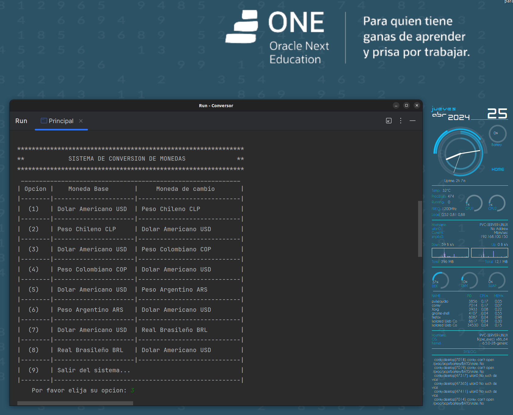

# CONVERSOR DE MONEDAS

El desafío del Conversor de Monedas, es parte de la curricula del curso de  desarrollador back-end del proyecto **Oracle ONE (G6) de Alura Latam,** en el cual se muestra un caso de uso como de la vida real, para solucionar problemas con Java y orientación a objetos a través de una API. 

## Caracteristicas
El conversor ha sido desarrollado en JAVA, y en un primer vistazo, podrá apreciar que de manera intuitiva a través de un sencillo menu puede elegir las monedas a cabiar asociadas en pares de cambio usando como referencia o moneda base que fijara el tipo de cambio y por supuesto el monto que desea cambiar.

### Funcionamiento
	- Menu con pares de cambio predefinidos para evitar errores al elegir monedas.
	- Conexion con  https://v6.exchangerate-api.com para consumir API y obtener datos.
	- Recibir del usuario la cantidad que desea cambiar.
	- Efectuar el cambio y mostrar la transacción

### Demo
)

### Ejecutar ejemplo
* Descargue o clone el proyecto
* Obtenga su APY_KEY en https://www.exchangerate-api.com/
* Abra la ruta: src/com/willmer/covertidor/calculos/ConsultaDivisa.java y remplave el contenido de la variable apiKey
* compile y ejecute desde IDE

### El Autor
Willmer Molina
Aprendis desarrollador Back-End

[Linkedin](www.linkedin.com/in/willmer-molina-lopez/)
[GitHub](https://github.com/willmermolina/)
  

